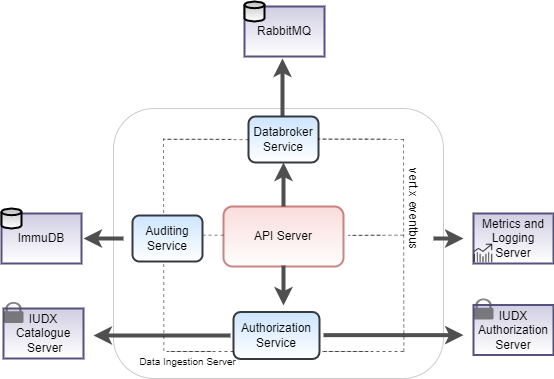

<div class="img_background">
<div style={{textAlign: 'center'}}>

<br/>

</div></div>

+ The Data Ingestion Server is the "Ingestion Firewall and Data Cleaning Middleware" of IUDX. It enables Providers and Delegates to publish data using the IUDX API as per the data descriptor using the HTTP protocol over TLS(HTTPs).

+ Will be deploying using swarm stack yaml files

### Installation

1. Navigate to the directory:
   
    ```
    cd iudx-deployment/Docker-Swarm-deployment/single-node/data-ingestion-server/
    ```

2. Assign the node label if not assigned during swarm installation:
   
    ```
    docker node update --label-add di-node=true <node_name>
    ```

3. Make a copy of the sample secrets directory by running the following command:
   
    ```
    cp -r example-secrets/secrets .
    ```

4. Provide a correct config file for bringing up Data-Ingestion server. Substitute appropriate values using commands mentioned in config files.

5. Configure the `.di.env` file, referring to `example-env`.

6. Define appropriate values of resources in in `di-stack.resources.yml` as shown in the sample file **[example-di-stack.resources.yaml](https://github.com/datakaveri/iudx-deployment/blob/5.0.0/Docker-Swarm-deployment/single-node/data-ingestion-server/example-di-stack.resources.yaml)**.

    - CPU requests and limits
    - RAM requests and limits
    - PID limit

   
7. To install Data-Ingestion server stack, use the following command:

    ```   
    cp example-di-stack.resources.yaml di-stack.resources.yaml

    docker stack deploy -c di-stack.yaml -c di-stack.resources.yaml di
    ```

### Notes

1. di-server api documentation can be accessed from **https://< di-domain >/apis**
2. To check if the di-server are deployed and running: `docker stack ps di`
3. For more information on installation instructions, refer **[here](https://github.com/datakaveri/iudx-deployment/tree/5.0.0/Docker-Swarm-deployment/single-node/data-ingestion-server#install)**.
4. For more information about the di-server, refer **[here](https://github.com/datakaveri/iudx-data-ingestion-server#iudx-data-ingestion-server)**.
