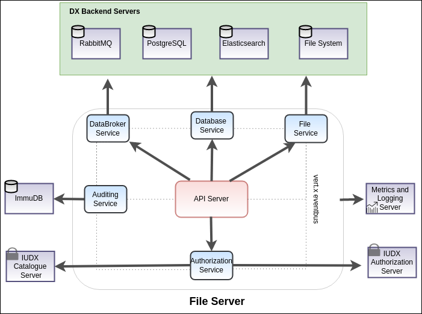

<div style={{textAlign: 'center'}}>

<br/>

</div>

+ The file server is IUDX archival, sample file data store which allows users to discovery, download and upload files. It allows data providers to upload and manage archives of data resources and its associated meta-data documents through APIs. It also allows data consumers to query the meta-data and download files as per the consent of the providers. The consumers can query the metadata and download files from the file server using HTTPs.


+ Will be deploying using swarm stack yaml files


#### Prerequisites:

Create a static cos cat index in Elasticsearch through Kibana.
- Create a static cat index with the name "< cos-prefix>__file-metadata" in Kibana by going to UI -> Dev Tools using the following github **[link](https://github.com/karthickp432001/iudx-developer-docs/blob/main/mapping/file-server-code.json)**.

### Installation:

1. Navigate to the below directory :
    ```
    cd iudx-deployment/K8s-deployment/Charts/file-server
    ```

2. Make a copy of the sample secrets directory:
    ```
    cp -r example-secrets/secrets .
    ```

3. Provide a correct config file for bringing up the File Server. Substitute appropriate values using commands mentioned in config files.

4. Configure the `secrets/.file-server.env` file with appropriate values in the placeholders `<...>`.

5. Define appropriate values of resources in `resource-values.yaml` as shown in the sample resource-values file for **[AWS](https://github.com/datakaveri/iudx-deployment/blob/5.0.0/K8s-deployment/Charts/rs-proxy/example-aws-resource-values.yaml)** and **[Azure](https://github.com/datakaveri/iudx-deployment/blob/5.0.0/K8s-deployment/Charts/rs-proxy/example-azure-resource-values.yaml)**:

    ```
    # For Azure
    cp example-azure-resource-values.yaml resource-values.yaml
    # For AWS
    cp example-aws-resource-values.yaml resource-values.yaml
    ```

    - Configure the following:
      - CPU and RAM for all File Server verticles.
      - `Ingress.hostname` 
      - Cert-manager issuer.

6. To install the File Server on the Kubernetes cluster, run the install script:
    ```
    ./install.sh
    ```

    This script will:
    - Create a namespace `file-server` on Kubernetes.
    - Create required ConfigMap and Secrets on Kubernetes.
    - Deploy all File Server verticles.

- To check Helm release info:
    ```
    helm list -n file-server
    ```

- To check if the File Server pods are deployed and running:
    ```
    kubectl get pods -n file-server
    ```

- For more information on installation instructions, refer **[here](https://github.com/datakaveri/iudx-deployment/tree/4.5.0/K8s-deployment/Charts/rs-proxy#introduction)**.
- For more information about the File Server, refer **[here](https://github.com/datakaveri/iudx-rs-proxy/tree/4.5.0#iudx-resource-proxy-server)**.

### Testing:

- File Server API documentation can be accessed from `https://<file-server-domain>/apis`.
- Check the logs of all pods in `file-server` namespace; there should not be any error log. If any errors are present, address them as specified/indicated by the log:
    ```
    kubectl logs -f -n fs <fs-server-pod-name>
    ```
