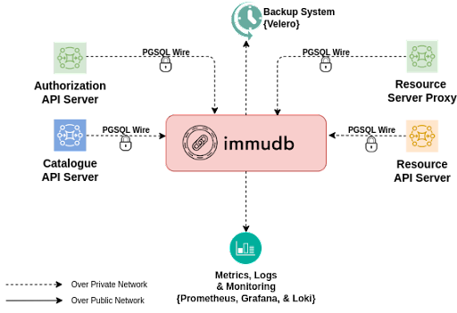

<div class="img_background">
<div style={{textAlign: 'center'}}>



</div></div>

- Immudb is being used as an immutable database for storing the auditing and metering data.
- Deployed as a non-clustered single instance.
- Will be deployed using stack yaml files.

### Installation

1. Navigate to the below directory:
   
    ```
    cd iudx-deployment/K8s-deployment/Charts/immudb
    ```

2. Make a copy of the sample secrets directory by running the following command:
   
    ```
    cp -r example-secrets/secrets .
    ```

3. Run the create-secrets script to automatically generate safe random passwords for the admin, auth, cat, and rs users in immudb using the following command:
   
    ```
    ./create-secrets.sh
    ```

    :::note
    Secrets are generated in the secrets/passwords directory for all users.
    :::

4. copy the example resource values YAML file to resource-values.yaml.
    
    ```
    cp example-aws-resource-values.yaml resource-values.yaml
    ```

5. Define appropriate values of resources in in 'resource-values.yaml' as shown in the sample resource-values file for **[aws](https://github.com/datakaveri/iudx-deployment/blob/5.0.0/K8s-deployment/Charts/immudb/example-aws-resource-values.yaml)** and **[azure](https://github.com/datakaveri/iudx-deployment/blob/5.0.0/K8s-deployment/Charts/immudb/example-azure-resource-values.yaml)**.

    - CPU requests and limits
    - RAM requests and limits
    - Instance-type for nodeSelector
    - StorageClassName
    - Size of the persistent volume required
    - **If its ONLY first time setup of immudb, consider enabling install.createUsers to true or else keep it false**.

   
6. To install immudb on the k8s cluster, run the install script using the following command: `./install.sh`:
    
    ```
    ./install.sh
    ```

    - Creates namespace immudb in K8s.
    - Creates the required secrets on K8s from the generated passwords.
    - Deploys the helm chart with the release name 'immudb'.
    - Post-install Hook will configure the immudb
    - Deploy the immuclient audit-mode for tampering

7. To install immuclient (optional) for connecting to immudb to perform manual database operations.
    
    1. Deploy using the following command: 
    
        ```
        kubectl apply -f immuclient.yaml -n immudb    
        ```
    
    2. To access immuclient pod:
        
        ```
        kubectl exec -it $(kubectl get pods -n immudb | awk '{print $1}' | grep 'immudb-client') /bin/bash -n immudb    
        ```
    
    3. To login to immuclient shell:
        
        ```
        /app/immuclient login immudb --password $immudb_admin_password; /app/immuclient
        ```
- To check helm release info: 
    ```
    helm list -n immudb
    ```
- To check if the immudb pods are deployed and running: 
    ```
    kubectl get pods -n immudb
    ```
- To see if databases, users and tables are created, check hook-install pod logs, and it should display successfully created database,users and tables:  
    ```
    kubectl logs -f -n immudb  immudb-0
    ```
- To access immudb and perform DB operations(creating index/tables) an immudb client deployment is required.

- For more information on installation instructions, refer **[here](https://github.com/datakaveri/iudx-deployment/tree/5.0.0/K8s-deployment/Charts/immudb#introduction)**.

- **[Immudb docs](https://docs.immudb.io/1.4.1/)**
- **[Immuclient docs](https://docs.immudb.io/1.4.1/connecting/clitools.html#immuclient)**

<details>
<summary><div class="test_color">Testing</div></summary>

1. Login to immudb using immuclient.
    ```
    kubectl exec -it $(kubectl get pods -n immudb | awk '{print $1}' | grep 'immudb-client') /bin/bash -n immudb
    ```

    ```
    # To login to immuclient shell:
    /app/immuclient login immudb --password $immudb_admin_password; /app/immuclient
    ```

2. Check if the intes-setup dbs (iudxauth, iudxcat, iudxrsorg), tables are created :
    
    ```yaml
    ImmuDB commands
    # Using Database
    use <database-name>
    #Listing tables
    tables
    #describe tables
    describe <table-name>
    ```
    
</details>
