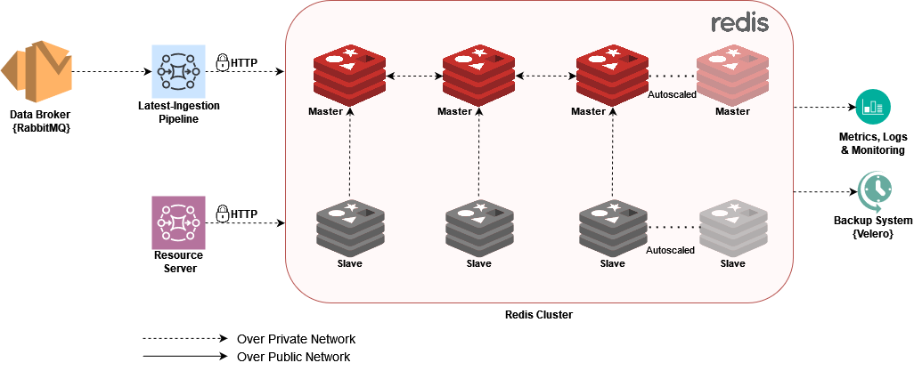

<div class="img_background">
<div style={{textAlign: 'center'}}>



</div></div>
 

- Redis is being used as the latest-data store.
- Deploys a 6-node Redis Cluster with sharding, having 3 master and 3 slaves by default.

- All masters serve as read-write points. All slaves replicate the masters they are attached to.
- The current architecture also consists of a custom autoscaler. Which auto-scales based on cpu usage of the nodes. 
    - If the cpu usage of a master is higher than the configured threshold. A master along with a slave will be added to the cluster and the shards will be rebalanced across all masters.
    - If the cpu usage of a slave is higher than the configured threshold. A single slave node will be added and attached to the same master of the slave node that had triggered the scale up.
- Will be deployed using a bitnami helm chart.


### Installation

1. Navigate to the below directory:

    ```
    cd iudx-deployment/K8s-deployment/Charts/redis
    ```

2. Run the create-secrets script to automatically generate safe random password for the redis user using the following command:

    ```
    ./create-secrets.sh
    ```
    **Secrets are generated in the secrets/ directory.**

3. copy the example resource values YAML file to resource-values.yaml.
    
    ```
    cp example-aws-resource-values.yaml resource-values.yaml
    ```

4. Define Appropriate values of resources in `resource-values.yaml` as shown in sample resource-values file for **[aws](https://github.com/datakaveri/iudx-deployment/blob/5.0.0/K8s-deployment/Charts/redis/example-aws-resource-values.yaml)** and **[azure](https://github.com/datakaveri/iudx-deployment/blob/5.0.0/K8s-deployment/Charts/redis/example-azure-resource-values.yaml)**.
    
    - CPU requests and limits
    - RAM requests and limits, 
    - Instance-type for nodeSelector
    - StorageClassName
    - Size of the persistent volume required 


5. To install redis on the k8s cluster, run the install script using the following command: 

    ```
    ./install.sh
    ```
    - Creates namespace redis in K8s.
    - Creates the required secrets on K8s from the generated passwords.
    - Deploys the helm chart with the release name ‘redis’.
    - Deploys redis autoscaler cron-job which autoscales the redis deployment by adding master/slave nodes depending on the requirement.


- To check helm release info: ‘helm list -n redis
- To check if the redis pods are deployed and running: ‘kubectl get pods -n redis
- For more information on installation instructions, refer here 

### Testing

1. Test if redis cluster is formed properly

    1. Login into redis cluster

        ```
        kubectl exec -it -n redis redis-redis-cluster-0 bash

        redis-cli -h localhost -a `cat $REDIS_PASSWORD_FILE` cluster info
        ```

    <div className="img_background">
    <div style={{textAlign: 'center'}}>
        
    </div>
    </div>